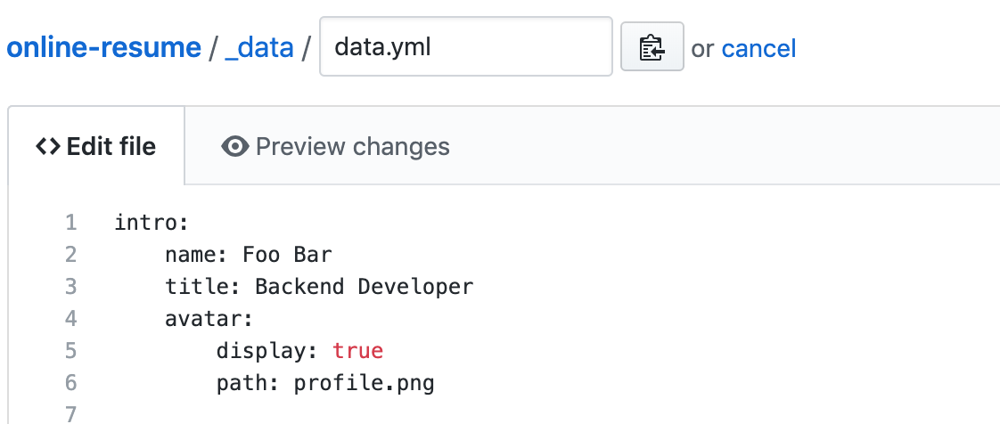
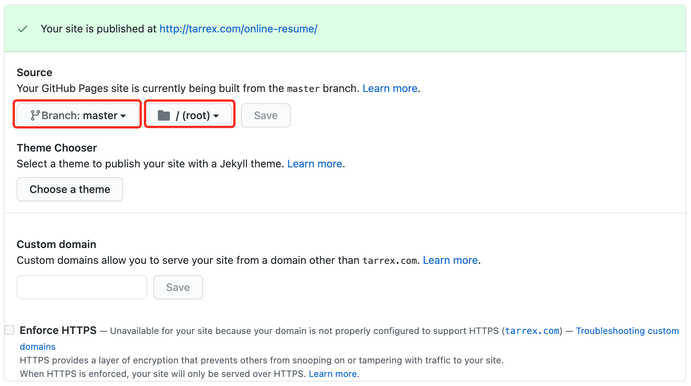
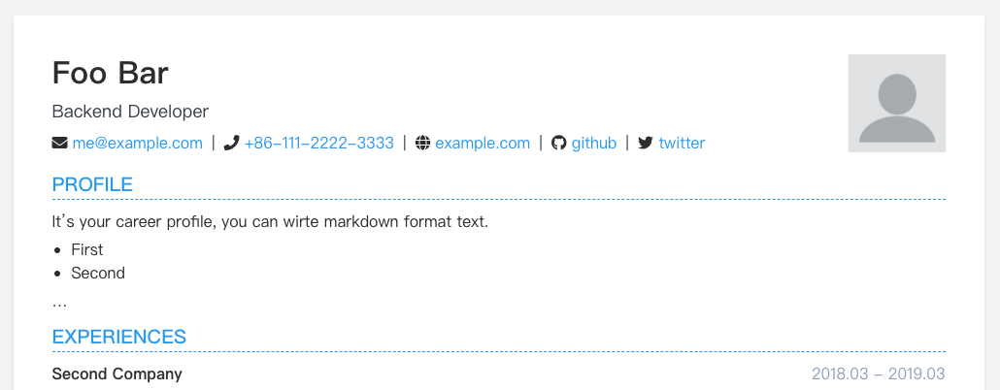

# online-resume

[English](README.md) | [简体中文](README_CN.md)

---

Yet another resume template based on jekyll. You can wirte your resume using markdown, it will be rendered into html and can be printed as pdf.

Features:

+ Easy to use/edit/hide
+ Jekyll + Markdown + Github Pages
+ Multiple languages
+ Multiple skins
+ Content modular
+ Responsive display
+ Print friendly

Enjoy yourself!

## Getting Started

### Usage

#### Quickly

Fork this repo:

Edit the yaml file located in `_data/data.yml`:

Setting the github pages source branch in `settings -> Github Pages -> source`, select `master branch`:

Wait a little while, open `https://YOUR_GITHUB_USERNAME.github.io/online-resume` in your browser. You can see your resume.

If you want to print your resume, just press shortcut of print. Also it can be saved as a pdf file.

#### Locally

If you want to use it locally, you shoule clone this repo then just like deploying a regular jekyll website.

### Customization

+ `_data/data.yml`: All the resume content.
+ `assets/images/profile.png`: Your profile photo.
+ `_config.yml`: Site's general settings.
+ `index.html`: Change the resume content's display order.
+ `_sass/_base.scss`: Change the resume display style.
+ `robots.txt`: If you don't want your resume to be recorded in the search engine, modify this file.

## License

[MIT](https://choosealicense.com/licenses/mit/)

## Acknowledgments

Inspired by [online-cv](https://github.com/sharu725/online-cv), this is a very amazing resume template.
